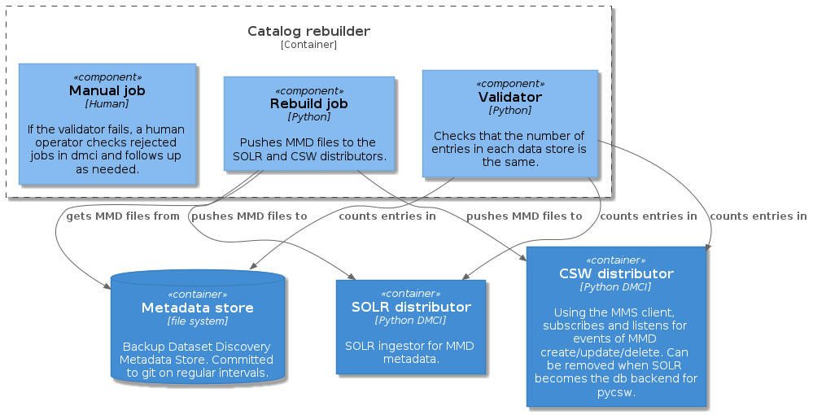

# S-ENDA Catalog rebuilder

Catalog rebuilder of CSW and Solr for the S-ENDA project.

## Design

The catalog-rebuilder consists of three modules.

* `main.py`- Main entrypoint for starting the Flask app
* `catalog_flask.py` - A Flask app for getting catalog status and rebuilding the catalog
* `catalog_rebuilder.py`- The rebuilding code, which is run as a Celery worker process. Imports
the DMCI package and use the DMCI worker for the processing.

The catalog-rebuilder will also need a `Redis`-server running.

## Environment Variables

The package bootstraps the DMCI module, so all environment variables and a
extended version of  the DMCI config file are required. See `config_default.yaml`for an example.

The package reads the following additional environment variables.

* `CATALOG_REBUILDER_LOGLEVEL` set the loglevel for both flask app and celery app
* `DMCI_CONFIG` the dmci config
* `PG_CSW_USERNAME` the pycsw postgresql username
* `PG_CSW_PASSWORD` the pycsw postgresql password
* `SOLR_USERNAME` the solr username
* `SOLR_PASSWORD` the solr password
* `INIT_REPO_URL` the url for the repo to rebuild from
* `INIT_REPO_USER` user credentials for the repo
* `INIT_REPO_PASSWORD` password credentials for the repo

## Flask app endpoints

* `/status` - Show Catalog Integrity Status
* `/admin` - Admin endpoint for cleaning the backends and rebuilding the catalog
* `/rebuild/result`- This endpoint will give back a JSON-object with the result of the ingestion
* `/dmci/rejected` - Inspect the contents of the DMCI rejected jobs
* `/dmci/workdir` - Inspect the distributor cache workdir

## Celery Worker Sidecar

The catalog-rebuilder will use its own Celery worker process in a sidecar, and process using
DMCI worker object.

## License

Copyright 2021 MET Norway

Licensed under the Apache License, Version 2.0 (the "License"); you may not use this file except in
compliance with the License. You may obtain a copy of the License at
http://www.apache.org/licenses/LICENSE-2.0

Unless required by applicable law or agreed to in writing, software distributed under the License
is distributed on an "AS IS" BASIS, WITHOUT WARRANTIES OR CONDITIONS OF ANY KIND, either express or
implied. See the License for the specific language governing permissions and limitations under the
License.

See Also: [LICENSE](https://raw.githubusercontent.com/metno/catalog-rebuilder/main/LICENSE)
